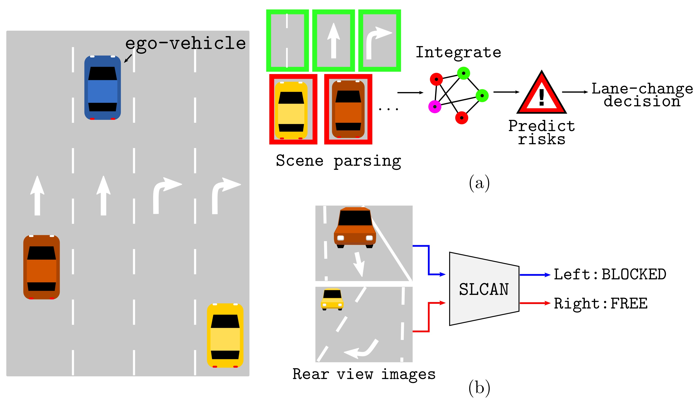

# End-to-end Learning of Image based Lane-Change Decision

## Authors
  - Seong-Gyun Jeong
  - Jiwon Kim
  - Sujun Kim
  - Jaesik Min

## Abstract
  We propose an image based end-to-end learning framework that helps lane-change decisions for human drivers and autonomous vehicles. The proposed system, Safe Lane-Change Aid Network (SLCAN), trains a deep convolutional neural network to classify the status of adjacent lanes from rear view images acquired by cameras mounted on both sides of the vehicle. Rather than depending on any explicit object detection or tracking scheme, SLCAN reads the whole input image to directly decide whether initiation of the lane-change at the moment is safe or not. Over 77k rear side view images are collected and annotated to train and test SLCAN. Experimental results show that the proposed framework achieves 96.98% classification accuracy although the test images are from unseen roadways. We also visualize the saliency map to understand which part of image SLCAN looks at for correct decisions.

  
  - (a) A typical approach to lane-change decision first detects individual driving-relevant objects with sophisticated perception algorithms. Then, additional steps are needed to integrate the perception results and to compute potential risk of lane-change. 
  - (b) The proposed approach trains a DCNN that interprets rear view images and directly renders a lane-change decision.

## Video results

